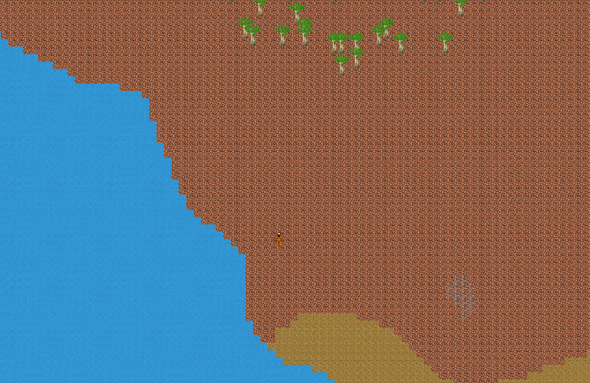

# FACTRIX

# Descriere generală

- Factrix este un joc inspirat din jocul cu nume similar Factorio. Acțiunea urmărește prăbușirea jucătorului pe o planetă necunoscută, de unde acesta va trebui să scape prin industrializare.
- Momentan gameplayul este limitat, însă arhitectura permite o dezvoltare uniformă și modulară rapidă.

# Control
- w,a,s,d - mișcare
- e - inventar
- RMB - minat
- LMB - construit/interacțiuni

# Cerințe

- pentru fiecare cerință (sau subcerință) neîndeplinită se scade **1** punct
- [x] definirea a minim **2-3 ieararhii de clase** care sa interactioneze in cadrul temei alese (fie prin compunere, agregare sau doar sa apeleze metodele celeilalte intr-un mod logic)
  - minim o clasa cu:
    - [x] constructori de inițializare [*](https://github.com/Ionnier/poo/tree/main/labs/L02#crearea-obiectelor)
    - [x] constructor supraîncărcat [*](https://github.com/Ionnier/poo/tree/main/labs/L02#supra%C3%AEnc%C4%83rcarea-func%C8%9Biilor)
    - [x] constructori de copiere [*](https://github.com/Ionnier/poo/tree/main/labs/L02#crearea-obiectelor)
    - [x] `operator=` de copiere [*](https://github.com/Ionnier/poo/tree/main/labs/L02#supra%C3%AEnc%C4%83rcarea-operatorilor)
    - [x] destructor [*](https://github.com/Ionnier/poo/tree/main/labs/L02#crearea-obiectelor)
    - [x] `operator<<` pentru afișare (std::ostream) [*](https://github.com/Ionnier/poo/blob/main/labs/L02/fractie.cpp#L123)
    - [x] `operator>>` pentru citire (std::istream) [*](https://github.com/Ionnier/poo/blob/main/labs/L02/fractie.cpp#L128)
    - [x] alt operator supraîncărcat ca funcție membră [*](https://github.com/Ionnier/poo/blob/main/labs/L02/fractie.cpp#L32)
    - [x] alt operator supraîncărcat ca funcție non-membră [*](https://github.com/Ionnier/poo/blob/main/labs/L02/fractie.cpp#L39) - nu neaparat ca friend
  - in derivate
      - [x] implementarea funcționalităților alese prin [upcast](https://github.com/Ionnier/poo/tree/main/labs/L04#solu%C8%9Bie-func%C8%9Bii-virtuale-late-binding) și [downcast](https://github.com/Ionnier/poo/tree/main/labs/L04#smarter-downcast-dynamic-cast)
        - aceasta va fi făcută prin **2-3** metode specifice temei alese
        - funcțiile pentru citire / afișare sau destructorul nu sunt incluse deși o să trebuiască să le implementați 
      - [x] apelarea constructorului din clasa de bază din [constructori din derivate](https://github.com/Ionnier/poo/tree/main/labs/L04#comportamentul-constructorului-la-derivare)
      - [x] suprascris [cc](https://github.com/Ionnier/poo/tree/main/labs/L04#comportamentul-constructorului-de-copiere-la-derivare)/op= pentru copieri/atribuiri corecte
      - [x] destructor [virtual](https://github.com/Ionnier/poo/tree/main/labs/L04#solu%C8%9Bie-func%C8%9Bii-virtuale-late-binding)
  - pentru celelalte clase se va definii doar ce e nevoie
  - minim o ierarhie mai dezvoltata (cu 2-3 clase dintr-o clasa de baza)
  - ierarhie de clasa se considera si daca exista doar o clasa de bază însă care nu moștenește dintr-o clasă din altă ierarhie
- [x] cât mai multe `const` [*](https://github.com/Ionnier/poo/tree/main/labs/L04#reminder-const-everywhere)
- [x] funcții și atribute `static` (în clase) [*](https://github.com/Ionnier/poo/tree/main/labs/L04#static)
  - [x] 1+ atribute statice non-triviale 
  - [x] 1+ funcții statice non-triviale
- [x] excepții [*](https://github.com/Ionnier/poo/tree/main/labs/L04#exception-handling)
  - porniți de la `std::exception`
  - ilustrați propagarea excepțiilor
  - ilustrati upcasting-ul în blocurile catch
  - minim folosit într-un loc în care tratarea erorilor în modurile clasice este mai dificilă
- [x] folosirea unei clase abstracte [*](https://github.com/Ionnier/poo/tree/main/labs/L04#clase-abstracte)
- [x] clase template
  - [x] crearea unei clase template [*](https://github.com/Ionnier/poo/tree/main/labs/L08)
  - [x] 2 instanțieri ale acestei clase
- [x] STL [*](https://github.com/Ionnier/poo/tree/main/labs/L07#stl)
  - [x] utilizarea a două structuri (containere) diferite (vector, list sau orice alt container care e mai mult sau mai putin un array)
  - [x] utilizarea a unui algoritm cu funcție lambda (de exemplu, sort, transform)
-  [x] Design Patterns [*](https://github.com/Ionnier/poo/tree/main/labs/L08)
  - [x] utilizarea a două șabloane de proiectare
